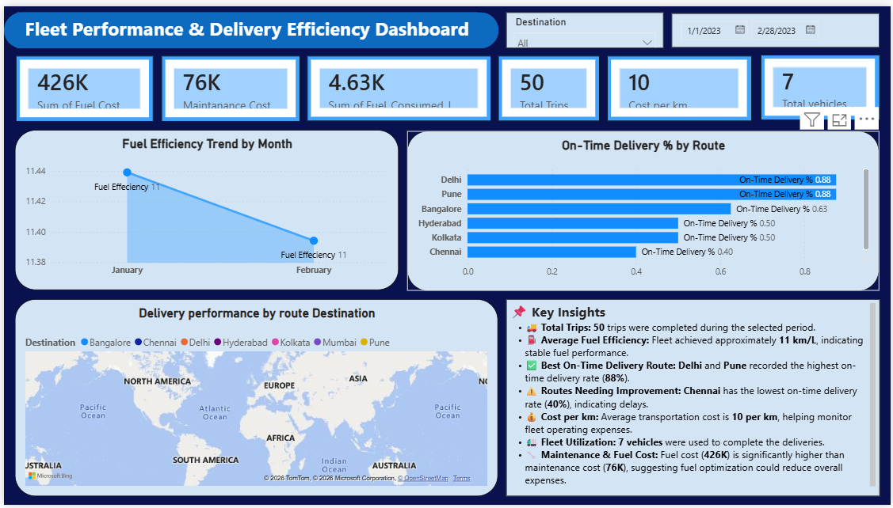

📊 Fleet Performance & Delivery Efficiency Dashboard
📌 Project Overview

This project is an interactive Fleet Performance & Delivery Efficiency Dashboard developed using Microsoft Power BI. The dashboard analyzes fleet operations by monitoring fuel efficiency, delivery performance, transportation costs, and vehicle utilization. It helps logistics managers optimize routes and improve operational efficiency.

🎯 Problem Statement

A logistics company wants to analyze fleet performance in terms of:

Fuel Efficiency
On-Time Deliveries
Cost per Kilometer
Vehicle Utilization

The objective is to optimize routes and improve fleet performance.

🛠 Tools Used
Microsoft Excel
Microsoft Power BI
Power Query
DAX

📂 Dataset
Trip Data
Trip ID
Vehicle ID
Driver ID
Origin
Destination
Distance (km)
Fuel Consumed (liters)
Delivery Status
Delivery Date
Vehicle Master
Vehicle ID
Vehicle Type
Capacity
Maintenance Cost
🧹 Data Cleaning

Removed duplicate records
Handled missing values
Filled missing Fuel Consumed values
Changed data types
Created relationship between Trips and Vehicle Master

📐 DAX Measures
Fuel Efficiency
On-Time Trips
Total Trips
On-Time Delivery %
Fuel Cost
Cost per km

📈 Dashboard Features
💰 Total Fuel Cost
🔧 Total Maintenance Cost
⛽ Total Fuel Consumed
🚚 Total Trips
🚛 Total Vehicles
📈 Fuel Efficiency Trend by Month
📊 On-Time Delivery % by Route
📅 Date Slicer
📍 Destination Slicer
💡 Key Insights

Total Trips Completed: 50
Fleet consists of 7 Vehicles
Total Fuel Cost: 426K
Total Maintenance Cost: 76K
Average Cost per km: 10
Delhi and Pune achieved the highest On-Time Delivery Rate (88%)
Chennai recorded the lowest On-Time Delivery Rate (40%)
Fuel Efficiency remained around 11 km/L
Fuel costs contribute more than maintenance costs, indicating opportunities for fuel optimization.

🖼 Dashboard Preview

📁 Repository Files
Fleet Performance Dashboard.pbix
Logistics Dataset.xlsx
Dashboard.png
README.md
🎯 Project Outcome

This dashboard enables logistics managers to:

Monitor fleet performance
Improve delivery efficiency
Reduce transportation costs
Track fuel efficiency
Optimize delivery routes
Make data-driven decisions
👩‍💻 Author

Zineera
